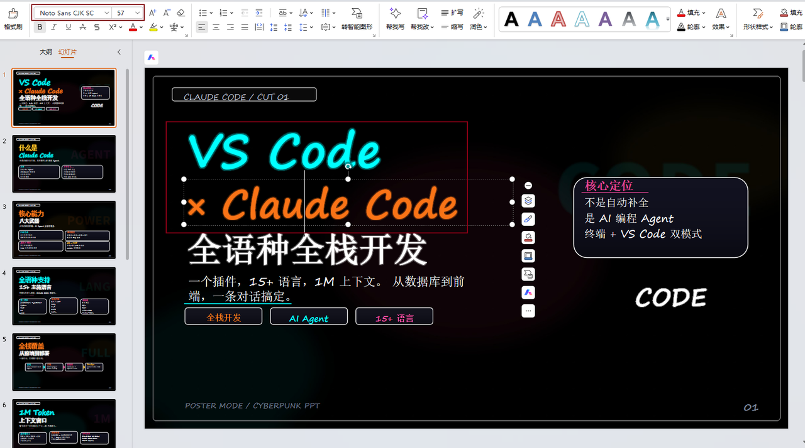

# Cyberpunk PPT Maker

一个 Claude Code 技能（Skill）。你只需用自然语言描述需求，Claude 自动生成暗黑霓虹赛博朋克风格的 PPT 演示文稿、视频封面、社交海报。

纯黑背景 + 霓虹光晕 + 网格纹理 + 渐变面板。所有文字保持可编辑，视觉元素自动生成。

## 1. 这个 Skill 能做什么

| 能力 | 说明 |
|------|------|
| **PPT 演示文稿** | 生成完整的多页 PPTX，10 种内置布局，文字全部可编辑 |
| **视频封面** | 抖音/TikTok (1080x1920)、YouTube/B站 (1920x1080)、小红书 (1080x1440) |
| **社交海报** | 小红书封面、竖版海报，多种尺寸 |
| **批量导出** | 同时输出 PPTX + PDF + PNG，一次搞定 |

---

## 2. 效果展示

详细见：[视频/笔记封面和PPT生成讲解](https://zcn93dhcbthz.feishu.cn/docx/TS8Dd8LvioR2e6xut5RcmsHfnzD)

**ppt生成效果：**
 

**封面生成效果：**
  

## 3. 快速开始

### 3.1 安装 Skill

将本项目放到 Claude Code 的 skills 目录下：

```bash
# 方式一：手动克隆
git clone https://github.com/soycodetrail/cyberpunk-ppt-maker.git \
  ~/.claude/skills/cyberpunk-ppt-maker

# 方式二：使用npx安装
npx skills add https://github.com/soycodetrail/cyberpunk-ppt-maker.git

# 方式三：如果已有 skills 管理工具，按其方式安装
```

### 3.2 安装依赖

```bash
pip install python-pptx pillow
```

**导出 PDF/PNG（可选）：**

| 平台 | 安装命令 |
|------|---------|
| Ubuntu/Debian | `sudo apt install libreoffice poppler-utils` |
| macOS | `brew install libreoffice poppler` |
| Windows | 从 [LibreOffice 官网](https://www.libreoffice.org/download/) 下载安装；从 [poppler-windows Releases](https://github.com/oschwartz10612/poppler-windows/releases/) 下载解压，并将 `bin/` 目录添加到系统 `PATH` |

**中文字体（必需）：**

| 平台 | 安装方式 |
|------|---------|
| Ubuntu/Debian | `sudo apt install fonts-noto-cjk fonts-dejavu` |
| macOS | `brew install font-noto-sans-cjk-sc` 或系统已自带中文字体 |
| Windows | 下载 [Google Noto CJK 字体](https://fonts.google.com/noto/fonts) 并双击安装，或安装系统自带的中文字体包 |

### 3.3 在 Claude Code 中使用

安装后，直接在 Claude Code 对话中描述你的需求即可。以下是一些典型用法：

---

## 4. 使用示例

### 4.1 生成一套 PPT 演示文稿

```
帮我生成一个关于"AI Agent 开发入门"的赛博朋克风格 PPT，10页左右，
包括封面、什么是 Agent、核心架构、开发工具链、实战案例、结尾页。
```

Claude 会自动：
1. 规划每页的布局和内容
2. 生成赛博朋克背景图片
3. 产出可编辑的 PPTX 文件
4. 如果需要，同时导出 PDF 和 PNG

### 4.2 生成视频封面

```
帮我做一个抖音视频封面，主题是"Python 爬虫实战"，
用赛博朋克风格，1080x1920 竖版。
```

Claude 会自动选择 `lecture-vertical` 画布，生成单页封面并导出 PNG。

### 4.3 生成小红书封面

```
做一个赛博朋克风格的小红书封面，主题是"本地部署大模型"，
要有冲击力，标签用橙色和青色。
```

Claude 会自动选择 `xhs-vertical` 画布，生成适合小红书的竖版海报。

### 4.4 更多触发方式

你可以在对话中用这些说法触发此 Skill：

- "做一个赛博朋克风格的 PPT"
- "生成霓虹科技风封面"
- "帮我做抖音视频封面"
- "小红书封面 赛博朋克"
- "把这份内容做成 dark neon 风格的演示文稿"

---

## 5. 支持的画布尺寸

| 画布 | 尺寸 | 用途 |
|------|------|------|
| `widescreen` | 1920x1080 (16:9) | PPT 演示、YouTube/B站封面 |
| `xhs-vertical` | 1080x1440 (3:4) | 小红书封面、社交海报 |
| `lecture-vertical` | 1080x1920 (9:16) | 抖音/TikTok封面、竖版课件 |

默认使用 `widescreen`。Claude 会根据你的描述自动选择合适的画布。

---

## 6. 十种内置布局

| 布局 | 效果 | 典型用途 |
|------|------|---------|
| `cover` | 大标题 + 副标题 + 芯片标签 + 卡片 | 封面页、视频封面 |
| `poster_cards` | 标题 + 2-3 张横排卡片 | 内容展示、对比 |
| `flow` | 节点 + 箭头连接 | 流程图、工作流 |
| `grid_four` | 2x2 网格卡片 | 四个并列要点 |
| `split` | 左右各一个面板 | 对比、优劣势分析 |
| `code_mix` | 左侧代码 + 右侧卡片 | 技术演示、命令展示 |
| `timeline` | 水平时间线 + 步骤 | 里程碑、发展历程 |
| `wide_stack` | 全宽面板逐行堆叠 | 步骤列表、要点展开 |
| `statement` | 居中彩色大字短语 | 核心观点、宣言总结 |
| `ending` | 居中标题 + footer | 结尾页 |

Claude 会根据内容自动选择最佳布局，你也可以指定。

---

## 7. 颜色系统

12 种内置霓虹色，可在对话中直接指定：

| 名称 | 色感 | 典型用途 |
|------|------|---------|
| `CYAN` | 青色/蓝绿 | 主标题、科技感 |
| `ORANGE` | 橙色 | 主标题、强调、警告 |
| `PINK` | 粉色 | 主标题、活力 |
| `YELLOW` | 金黄 | 主标题、高亮 |
| `PURPLE` | 紫色 | 辅助强调 |
| `RED` | 红色 | 警告、重要标记 |
| `BLUE` | 蓝色 | 辅助强调 |
| `LIME` | 青绿 | 成功、完成 |
| `TEAL` | 蓝绿 | 信息标记 |
| `WHITE` | 白色 | 正文、副标题 |
| `MUTED` | 灰蓝 | 次要注释 |
| `SOFT` | 柔灰 | 页码、底部信息 |

推荐配色组合：
- **科技感**：CYAN + ORANGE
- **活力感**：PINK + YELLOW
- **未来感**：CYAN + PURPLE
- **危险感**：RED + ORANGE

---

## 8.  视频封面速查

| 平台 | 对 Claude 说 | 实际画布 |
|------|-------------|---------|
| 抖音/TikTok/快手 | "竖屏封面"、"1080x1920" | `lecture-vertical` |
| YouTube/B站 | "横屏封面"、"1920x1080" | `widescreen` |
| 小红书 | "小红书封面"、"1080x1440" | `xhs-vertical` |
| 微信视频号 | "竖屏封面" | `lecture-vertical` |

---

## 9. 视觉风格

赛博朋克 PPT 的视觉 DNA 是固定的，不需要你操心：

- **背景**：纯黑 + 超细灰色网格纹理 + 柔和光晕
- **面板**：深色渐变填充 + 霓虹发光边框 + 外阴影
- **标题**：自带霓虹外发光效果 + 彩色分割线装饰
- **文字**：短标题、大字号、自动换行、长文本自动缩放
- **整体**：暗黑、高对比、硬边无衬线

你只需要关注**内容**，视觉交给 Skill。

---

## 10. 输出格式

所有生成的文件会自动整理到统一目录下，**跨平台兼容**（Linux / macOS / Windows）：

```
~/ai-gen-ppt/<主题>_<时间戳>/
├── <主题>.pptx          # 可编辑 PPT
├── <主题>.pdf           # PDF 版本（可选）
├── spec.json            # 生成规格
├── assets/              # 赛博朋克背景资源
│   ├── poster_bg_01.jpg
│   └── ...
└── png/                 # 逐页 PNG（可选）
    ├── slide_01.png
    └── ...
```

示例：
```
~/ai-gen-ppt/AI_绘图2026_全景模型横评_20260503_2315/
~/ai-gen-ppt/本地部署指南_20260504_0900/
```

| 格式 | 说明 |
|------|------|
| `.pptx` | 可编辑的 PPT 文件，所有文字可修改 |
| `.pdf` | 用于分享和打印 |
| `.png` | 每页独立图片，可直接上传到各平台 |

你可以在对话中指定需要哪些格式。Claude 会自动调用对应的脚本。

如果你手动指定了 `--output` 等路径参数，则以你指定的路径为准（向后兼容）。

## 11. 项目结构

```
cyberpunk-ppt-maker/
├── SKILL.md                               # AI Agent 指令（Claude 读取此文件）
├── README.md                              # 本文件
│
├── docs/                                  # 文档
│   ├── zero-to-hero-guide.md              # ★ 从零到一完全指南（原理 + 改造）
│   └── images/                            # 文档配图
│
├── assets/examples/                       # 可直接使用的示例
│   ├── cyberpunk-demo-spec.json           # JSON 规格示例
│   ├── cyberpunk-demo-outline.md          # Markdown 大纲示例
│   ├── xhs-vertical-cover-outline.md      # 小红书封面示例
│   └── lecture-vertical-outline.md        # 竖版课件示例
│
├── references/                            # 详细参考文档
│   ├── spec-format.md                     # JSON 规格完整格式
│   ├── markdown-outline-format.md         # Markdown 大纲完整语法
│   ├── style-guide.md                     # 视觉风格规范
│   └── prompt-templates.md                # AI 图像生成提示词
│
└── scripts/                               # 后端生成脚本（Claude 自动调用）
    ├── generate_cyberpunk_ppt.py          # JSON → PPTX
    ├── markdown_to_cyberpunk_spec.py      # Markdown → 全套输出
    ├── export_cyberpunk_images.py         # PPTX → PNG
    └── clone_reference_cyberpunk_style.py # 风格克隆
```

---

## 12. 给开发者的参考

### 12.1 从零到一完全指南（强烈推荐）

如果你想**理解实现原理**或**改造出自己风格的 PPT Skill**，请阅读这份超详细的培训文档：

**[docs/zero-to-hero-guide.md](docs/zero-to-hero-guide.md)**

它包含：

| 内容 | 说明 |
|------|------|
| **核心原理拆解** | 逐行解读 1210 行核心引擎，OOXML 注入、文字测量、背景生成的每个细节 |
| **5 级改造路线** | 从 15 分钟换颜色到半天打造全新风格，每级都有完整代码示例 |
| **零基础友好** | 每个概念都有图解和比喻，改造不需要懂 PPT 底层技术 |
| **多种风格参考** | 商务蓝、学术风、暗黑极简、中国风等 7 种风格的改造方向 |

无论你是想微调颜色，还是要做出完全不同风格的 PPT 生成器，这份指南都能让你快速上手。

---

### 12.2 API 参考文档

如果你需要直接使用 Python 脚本（而非通过 Claude Code），详细文档在 `references/` 目录下：

- **JSON 规格格式**：[references/spec-format.md](references/spec-format.md)
- **Markdown 大纲语法**：[references/markdown-outline-format.md](references/markdown-outline-format.md)
- **视觉风格规范**：[references/style-guide.md](references/style-guide.md)

### 12.3 脚本直接调用

```bash
# 自动输出模式（推荐）— 省略 --output，自动整理到 ~/ai-gen-ppt/
python3 scripts/markdown_to_cyberpunk_spec.py \
  --input outline.md

# JSON → PPTX（自动输出）
python3 scripts/generate_cyberpunk_ppt.py \
  --spec spec.json

# JSON → PNG（自动输出到 ~/ai-gen-ppt/<title>_<ts>/png/）
python3 scripts/export_cyberpunk_images.py \
  --spec spec.json

# 显式指定路径（向后兼容）
python3 scripts/markdown_to_cyberpunk_spec.py \
  --input outline.md --output spec.json \
  --pptx-output deck.pptx --pdf-output deck.pdf --png-dir ./pngs

python3 scripts/generate_cyberpunk_ppt.py \
  --spec spec.json --output deck.pptx
```

### 12.4 自定义扩展

- **添加颜色**：编辑 `scripts/generate_cyberpunk_ppt.py` 中的 `COLORS` 字典
- **修改字体**：修改同文件中的 `FONT_PATH_*` 变量
- **添加布局**：添加 `render_<name>()` 函数，注册到 `RENDERERS` 等字典
- **调整背景**：修改 `build_poster_background()` / `build_lecture_background()` 函数

更详细的改造步骤和代码示例，请参考 **[完全指南](docs/zero-to-hero-guide.md)**。

---

## 13. 常见问题

**Q: 我不懂编程，能用吗？**
可以。在 Claude Code 中用自然语言描述需求，Claude 自动完成所有技术操作。

**Q: 生成的 PPT 能编辑吗？**
可以。所有文字都是可编辑的文本框，背景是图片。直接在 PowerPoint/Keynote/WPS 中修改。

**Q: 能做抖音封面吗？**
可以。说"做一个竖屏视频封面"，Claude 会自动用 1080x1920 尺寸。

**Q: 文字太多会重叠吗？**
不会。生成器会精确测量文字尺寸，自动缩小字号适配容器。

**Q: 能指定某个布局吗？**
可以。告诉 Claude 你想要的布局名，如"用 timeline 布局"或"左右对比"。

**Q: 导出 PDF/PNG 报错？**
需要安装 `libreoffice` 和 `poppler-utils`。见上方安装依赖部分。

---

## 许可证

[MIT License](LICENSE)

## 作者

SoyCodeTrail

### 联系作者


- 微信
  

- 小红书

  

## 友情链接

- [LINUX DO - 新的理想型社区](https://linux.do/)

